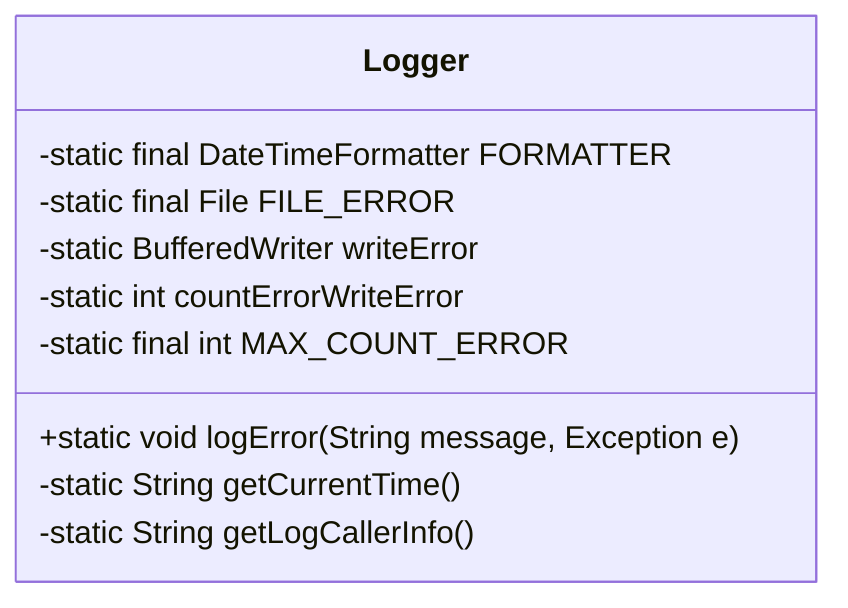
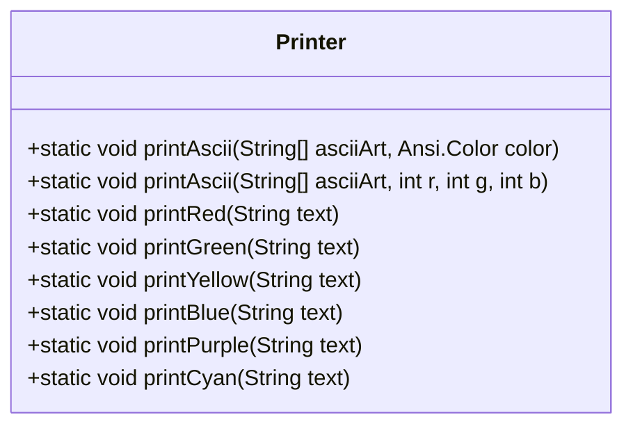
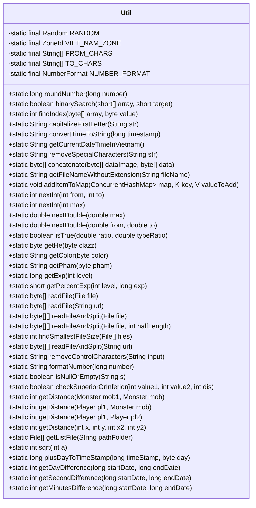

# Utilities

<cite>
**Referenced Files in This Document**   
- [Logger.java](file://src/main/java/utils/Logger.java)
- [Printer.java](file://src/main/java/utils/Printer.java)
- [Util.java](file://src/main/java/utils/Util.java)
- [CommandMessage.java](file://src/main/java/utils/CommandMessage.java)
</cite>

## Table of Contents
1. [Introduction](#introduction)
2. [Logging Framework](#logging-framework)
3. [Console Output Utilities](#console-output-utilities)
4. [Common Utility Methods](#common-utility-methods)
5. [Command Message System](#command-message-system)
6. [Usage Examples](#usage-examples)
7. [Performance Considerations](#performance-considerations)

## Introduction
This document provides comprehensive documentation for the utility components that support the entire codebase of the KPAH-qoder application. The utilities are organized into four main categories: logging framework, console output formatting, common data manipulation methods, and server command messaging. These components are essential for maintaining system stability, debugging issues, and ensuring consistent behavior across the application.

## Logging Framework

The logging framework is implemented in the `Logger` class and provides error logging functionality with automatic timestamping, stack trace capture, and file persistence. The framework creates timestamped log files in a dedicated `log/` directory and formats error messages with contextual information including the calling class, method, and line number.

The logging system captures:
- Error messages with custom descriptions
- Full exception stack traces
- Caller information (class, method, file, line)
- Timestamps in standardized format (yyyy-MM-dd HH:mm:ss)

Log files are created with filenames based on the current date and time (dd-MM-yyyy _ HH-mm-ss.log) and stored in the `log/` directory. The system includes error handling for log file creation failures and will terminate the application if the log directory cannot be created.



**Diagram sources**
- [Logger.java](file://src/main/java/utils/Logger.java#L1-L100)

**Section sources**
- [Logger.java](file://src/main/java/utils/Logger.java#L1-L100)

## Console Output Utilities

The console output utilities are implemented in the `Printer` class and provide color-coded text output using the Jansi library for ANSI escape code support. The utilities enable developers to format console output with different colors to distinguish between different types of messages and improve readability during development and debugging.

The available color output methods include:
- `printRed(String text)` - For error messages and critical alerts
- `printGreen(String text)` - For success messages and positive status
- `printYellow(String text)` - For warnings and cautionary information
- `printBlue(String text)` - For informational messages and debug output
- `printPurple(String text)` - For special notifications and events
- `printCyan(String text)` - For system status and operational messages

Additionally, the class provides methods for printing ASCII art with specified colors, supporting both predefined ANSI colors and custom RGB values.



**Diagram sources**
- [Printer.java](file://src/main/java/utils/Printer.java#L1-L48)

**Section sources**
- [Printer.java](file://src/main/java/utils/Printer.java#L1-L48)

## Common Utility Methods

The `Util` class contains a comprehensive collection of utility methods for string manipulation, number formatting, data conversion, and mathematical operations. These methods provide reusable functionality that is used throughout the codebase.

### String Manipulation
- `removeSpecialCharacters(String str)` - Converts Vietnamese characters with diacritics to their ASCII equivalents and replaces spaces with underscores
- `capitalizeFirstLetter(String str)` - Capitalizes the first letter of a string
- `removeControlCharacters(String input)` - Removes control characters and line breaks from strings

### Number Formatting and Mathematical Operations
- `formatNumber(long number)` - Formats numbers with US locale formatting (thousands separators)
- `roundNumber(long number)` - Rounds numbers to significant digits based on magnitude
- `sqrt(int a)` - Calculates square root using iterative approximation
- `nextInt(int from, int to)` - Generates random integers within a specified range
- `nextDouble(double from, double to)` - Generates random doubles within a specified range

### Data Conversion and Array Operations
- `readFile(File file)` - Reads entire files into byte arrays
- `readFileAndSplit(File file)` - Reads files and splits them into two byte arrays
- `binarySearch(short[] array, short target)` - Performs binary search on sorted arrays
- `findIndex(byte[] array, byte value)` - Finds the index of a value in a byte array
- `concatenate(byte[] dataImage, byte[] data)` - Concatenates two byte arrays with length prefixes

### Time and Date Utilities
- `convertTimeToString(long timestamp)` - Converts Unix timestamps to formatted date strings
- `getCurrentDateTimeInVietnam()` - Gets current date and time in Vietnam timezone
- `getDayDifference(long startDate, long endDate)` - Calculates day difference between timestamps
- `getSecondDifference(long startDate, long endDate)` - Calculates second difference between timestamps



**Diagram sources**
- [Util.java](file://src/main/java/utils/Util.java#L1-L410)

**Section sources**
- [Util.java](file://src/main/java/utils/Util.java#L1-L410)

## Command Message System

The `CommandMessage` class defines a comprehensive set of constants representing various command types and message identifiers used for server-client communication. These constants are used throughout the network layer to identify message types and route them to appropriate handlers.

The command messages are categorized into several functional groups:

### Authentication and Session Management
- `LOGIN` (1) - User login request
- `LOGOUT` (2) - User logout request
- `REQUEST_REGISTER` (39) - Account registration request

### Character and Player Actions
- `MOVE_CHAR` (4) - Character movement
- `CHAR_INFO` (5) - Character information request
- `PLAYER_ATTACK_PLAYER` (6) - Player vs player attack
- `PLAYER_ATTACK_MONSTER` (9) - Player vs monster attack
- `USE_POTION` (22) - Use potion item
- `USE_ITEM` (29) - Use general item
- `ADD_BASE_POINT` (34) - Add base stat points
- `ADD_SKILL_POINT` (36) - Add skill points

### Social and Clan Features
- `CHAT` (27) - General chat message
- `ADD_FRIEND` (101) - Add friend request
- `CMD_GET_FRIENDLIST` (102) - Get friend list
- `CLAN_INFO` (-12) - Clan information request
- `ADD_CLAN` (-11) - Add clan member
- `REG_CLAN` (-9) - Register new clan
- `CHAT_CLAN` (-18) - Clan chat message

### Inventory and Item Management
- `GET_ITEM_FROM_GROUND` (18) - Pick up item from ground
- `BUY_ITEM_FROM_NPC` (24) - Purchase item from NPC
- `SELL_ITEM` (28) - Sell item
- `PUT_ITEM_2_BAG` (68) - Put item in inventory
- `GET_ITEM_OUT_BAG` (69) - Take item from inventory
- `REPAIR_ITEM` (72) - Repair damaged item
- `IMBUE_ITEM` (71) - Enhance item with gems

### Map and Navigation
- `CHANGE_MAP` (12) - Change map request
- `MOVE_TO_MAP` (79) - Move to specific map
- `OPEN_MAP_BOSS` (-33) - Open boss map
- `LOCATION_SERVER` (105) - Server location information

### System and Administrative Commands
- `SERVER_MESSAGE` (37) - Server broadcast message
- `SERVER_INFO` (38) - Server information
- `ADMIN_COMMAND` (47) - Administrative command
- `CONFIG` (104) - Configuration settings

The command system uses byte values as identifiers, with negative values typically reserved for special or system commands, while positive values are used for gameplay actions. The `FULL_SIZE` constant (Byte.MIN_VALUE) appears to be used as a boundary marker.

```mermaid
classDiagram
class CommandMessage {
+static final byte REQUEST_KEY = -40
+static final byte ANIMAL_COMBINED = -61
+static final byte MESSAGE_WORLD = -60
+static final byte CMD_FARM = -59
+static final byte SKILL_CLAN = -56
+static final byte DROP_ITEM_TO_GROUND = -55
+static final byte CHANG_TYPE_ITEM = -54
+static final byte CLAN_TOP_LIST = -53
+static final byte CHE_DO = -52
+static final byte IMAGE_SERVER = -51
+static final byte BOSS_IMG = -50
+static final byte EFFECT_OBJ = -49
+static final byte LOAD_IMAGE_TREE = -48
+static final byte SET_CLIENT_TYPE = -1
+static final byte LOAD_IMAGE_MONSTER = -47
+static final byte SOUND_DATA = -46
+static final byte RIDE_ANIMAL = -45
+static final byte INFOO_ANIMAL_CHAR = -44
+static final byte DYNAMIC_OBJ = -43
+static final byte SET_CHAR_KHAM = -42
+static final byte GET_GEM_FROM_GROUND = -41
+static final byte WEATHER = -39
+static final byte FIGHT = -38
+static final byte QUEST_CLAN = -37
+static final byte EP_NGOC = -36
+static final byte KHAM_ITEM = -35
+static final byte REQUEST_KHAM = -34
+static final byte OPEN_MAP_BOSS = -33
+static final byte CUSTOM_POPUP = -32
+static final byte TEXT_BOX = -31
+static final byte MENU_OPTION = -30
+static final byte DROP_THANLAN = -29
+static final byte CAPCHA = -28
+static final byte GET_WEAPONE = -27
+static final byte MESSAGE_DELAY = -26
+static final byte CARD_TO_NPC = -25
+static final byte GET_STRING = -24
+static final byte DELL_GEM_ITEM = -23
+static final byte VIEW_INFO = -22
+static final byte DELL_POTION = -21
+static final byte TRANS_MONEY_CLAN = -20
+static final byte TOP_STRONGER_RICHER = -19
+static final byte CHAT_CLAN = -18
+static final byte MESSAGE_CLAN = -17
+static final byte SET_SOLOGAN_CLAN = -16
+static final byte OUT_CLAN = -15
+static final byte DISSOLVE_CLAN = -14
+static final byte EVICTION_CLAN = -13
+static final byte CLAN_INFO = -12
+static final byte ADD_CLAN = -11
+static final byte CHOOSE_ICON_CLAN = -10
+static final byte REG_CLAN = -9
+static final byte GET_IMAGE = -8
+static final byte CLAN_LIST = -7
+static final byte REMOVE_FRIEND = -6
+static final byte MESSAGE_PRIVATE = -5
+static final byte LOGIN = 1
+static final byte LOGOUT = 2
+static final byte MOVE_CHAR = 4
+static final byte CHAR_INFO = 5
+static final byte PLAYER_ATTACK_PLAYER = 6
+static final byte MONSTER_INFO = 7
+static final byte PLAYER_ATTACK_MONSTER = 9
+static final byte PING = 11
+static final byte CHANGE_MAP = 12
+static final byte CHARLIST = 13
+static final byte CREATE_CHAR = 14
+static final byte GET_ITEM_FROM_GROUND = 18
+static final byte GET_POTION_FROM_GROUND = 19
+static final byte ITEM_INFO = 21
+static final byte USE_POTION = 22
+static final byte NPC_INFO = 23
+static final byte BUY_ITEM_FROM_NPC = 24
+static final byte CHAT = 27
+static final byte SELL_ITEM = 28
+static final byte USE_ITEM = 29
+static final byte COME_HOME = 31
+static final byte ADD_BASE_POINT = 34
+static final byte ADD_SKILL_POINT = 36
+static final byte REQUEST_REGISTER = 39
+static final byte CREATE_PARTY = 48
+static final byte ADD_TO_PARTY = 49
+static final byte KICK_PARTY = 50
+static final byte USE_BUFF = 51
+static final byte QUEST = 52
+static final byte TALK_WITH_NPC = 53
+static final byte FINISH_QUEST = 54
+static final byte RESPONSE_QUEST = 55
+static final byte INFO_QUEST_LOGIN = 56
+static final byte INFO_NEXT_QUEST_LOGIN = 57
+static final byte LIST_MONSTER_MAP = 58
+static final byte NEW_HP_MP = 60
+static final byte GIVE_ITEM_TO_GROUND = 61
+static final byte BUY_ITEM_SHOP = 62
+static final byte USE_ITEM_SHOP = 63
+static final byte USE_ITEM_PK = 65
+static final byte TRADE = 66
+static final byte KILLER = 67
+static final byte REQUEST_MAIN_INFO = -2
+static final byte REQUEST_WEARING_INFO = -3
+static final byte PUT_ITEM_2_BAG = 68
+static final byte GET_ITEM_OUT_BAG = 69
+static final byte FINISH_PUT_ITEM_2_BAG = 70
+static final byte IMBUE_ITEM = 71
+static final byte REPAIR_ITEM = 72
+static final byte BUY_GEM_ITEM_FROM_NPC = 74
+static final byte ADD_ITEM_IMBUE = 75
+static final byte ADD_GEM_ITEM_IMBUE = 76
+static final byte DO_IMBUE_ITEM = 77
+static final byte SELL_GEM_ITEM = 78
+static final byte MOVE_TO_MAP = 79
+static final byte BUY_TICKET = 81
+static final byte UP_TO_BOARD = 82
+static final byte SHOP_ITEM = 84
+static final byte BUY_ITEM_SPECIAL = 85
+static final byte USE_ITEM_SPECIAL = 86
+static final byte DIAl_LUCKY = 87
+static final byte RQ_MAINCHAR_INFO = 88
+static final byte BUFF_ATTACK = 89
+static final byte REQUEST_SELL_ITEM = 92
+static final byte DEPOSITE_SELL_ITEM = 93
+static final byte GET_DEPOSITE_ITEM = 94
+static final byte BUY_DEPOSITE_ITEM = 95
+static final byte LOAD_RES = 96
+static final byte ADD_FRIEND = 101
+static final byte GET_INFO_TEMPLATE = 100
+static final byte GET_MAINCHAR_INFO = -100
+static final byte CMD_GET_FRIENDLIST = 102
+static final byte CMD_GET_SMSNAP = 103
+static final byte CONFIG = 104
+static final byte ATTACK_MULTI_MONSTER = 106
+static final byte CMD_NAP_SMS = 107
+static final byte DOWN_HORSE = 108
+static final byte LEAR_SKILL = 109
+static final byte LOCATION_SERVER = 105
+static final byte INFO_MAIN_CHAR = 3
+static final byte INFO_ACTOR_POS = 4
+static final byte CHAR_OUT = 8
+static final byte MONSTER_ATTACK_PLAYER = 10
+static final byte CHAR_WEARING = 15
+static final byte CHAR_INVENTORY = 16
+static final byte MONSTER_DIE = 17
+static final byte REMOVE_ACTOR = 20
+static final byte ITEM_TEMPLATE = 25
+static final byte MONSTER_TEMPLATE = 26
+static final byte SET_XP = 30
+static final byte SET_CHAR_PROPERTIES = 32
+static final byte LEVEL_UP = 33
+static final byte SKILL_INFO = 35
+static final byte SERVER_MESSAGE = 37
+static final byte SERVER_INFO = 38
+static final byte ADMIN_COMMAND = 47
+static final byte GIFT_QUEST = 59
+static final byte DROP_LIST = 64
+static final byte GEM_ITEM = 73
+static final byte SPECIAL_ITEM = 76
+static final byte XAPHU_TEMPLATE = 80
+static final byte BOSS_ATTACK = 83
+static final byte ACTOR_DIE = 90
+static final byte WEARING_POINT = 91
+static final byte MINI_GAME = -62
+static final byte CHAR_TO_MONSTER = -57
+static final byte CMD_TICKETS = -63
+static final byte CMD_NEW_QUEST = -64
+static final byte GET_ITEM_QUEST = -65
+static final byte CMD_FRUIT = -66
+static final byte CMD_TUBINH = -67
+static final byte TACH_NGUYEN_LIEU = -68
+static final byte CMD_AUTO_IMBUE = -69
+static final byte NEW_EFFECT = -70
+static final byte DYNAMIC_EFFECT = -71
+static final byte ON_INFO_DIALOG = -72
+static final byte PET_ATTACK = -73
+static final byte EFF_SKIL = -74
+static final byte TIME_COUNT_DOWN = -75
+static final byte SHOP_NEW = -76
+static final byte FULL_SIZE = Byte.MIN_VALUE
}
```



**Diagram sources**
- [CommandMessage.java](file://src/main/java/utils/CommandMessage.java#L1-L362)

**Section sources**
- [CommandMessage.java](file://src/main/java/utils/CommandMessage.java#L1-L362)

## Usage Examples

### Logging Error Messages
To log an error with exception details:
```java
try {
    // risky operation
} catch (Exception e) {
    Logger.logError("Failed to process player data", e);
}
```

### Console Output Formatting
To display colored messages in the console:
```java
Printer.printGreen("Server started successfully");
Printer.printRed("Critical error occurred");
Printer.printYellow("Configuration warning detected");
Printer.printBlue("Debug information: processing request");
```

### String and Number Utilities
To format numbers and manipulate strings:
```java
String formattedNumber = Util.formatNumber(1000000); // "1,000,000"
String cleanName = Util.removeSpecialCharacters("Nguyễn Văn A"); // "NGUYEN_VAN_A"
long roundedValue = Util.roundNumber(1234567); // 1200000
```

### Working with Command Messages
To send a message to a client:
```java
// In network message handling
if (command == CommandMessage.LOGIN) {
    // Handle login logic
}
// To send a server message
sendMessage(CommandMessage.SERVER_MESSAGE, messageData);
```

## Performance Considerations

### Logging Performance
The logging system uses virtual threads (Project Loom) to avoid blocking the main application thread when writing to log files. This asynchronous approach ensures that logging operations do not impact the performance of critical game loops. However, excessive logging in high-frequency methods should be avoided as it can still lead to resource contention.

### Frequently Called Utility Methods
Certain utility methods are called frequently throughout the codebase and should be used with consideration for performance:

- `getDistance()` methods are used in pathfinding and combat calculations. For performance-critical contexts, consider caching results when possible.
- `isTrue()` method uses random number generation and is used for probability-based game mechanics. The method is lightweight but should be used judiciously in tight loops.
- `removeSpecialCharacters()` involves string iteration and character lookup, making it relatively expensive for large strings or frequent calls.

### Memory Considerations
- `readFile()` and related methods load entire files into memory. For large files, consider using streaming alternatives.
- `concatenate()` creates new byte arrays and should be used carefully in performance-critical sections.
- The `addItemToMap()` method is synchronized, which may create contention in highly concurrent scenarios.

### Best Practices
1. Use logging primarily for error conditions and critical events, not for routine operations
2. Cache results of expensive utility calculations when values are reused
3. Avoid calling string manipulation utilities in tight game loops
4. Use appropriate data structures for frequent lookups instead of linear searches
5. Consider the performance implications of random number generation in time-sensitive contexts

**Section sources**
- [Logger.java](file://src/main/java/utils/Logger.java#L1-L100)
- [Printer.java](file://src/main/java/utils/Printer.java#L1-L48)
- [Util.java](file://src/main/java/utils/Util.java#L1-L410)
- [CommandMessage.java](file://src/main/java/utils/CommandMessage.java#L1-L362)