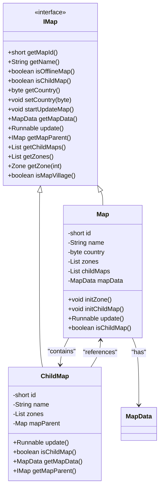
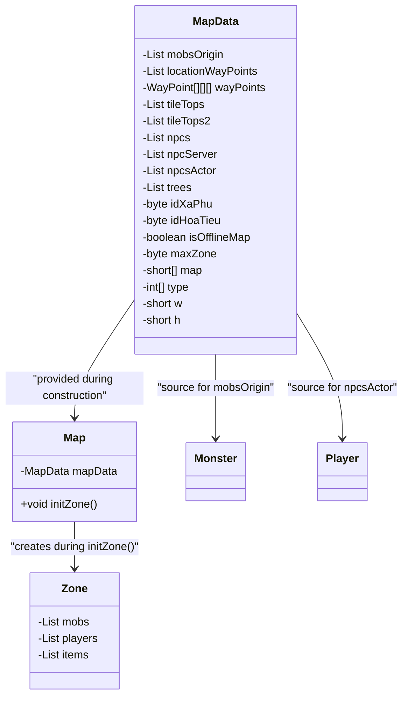
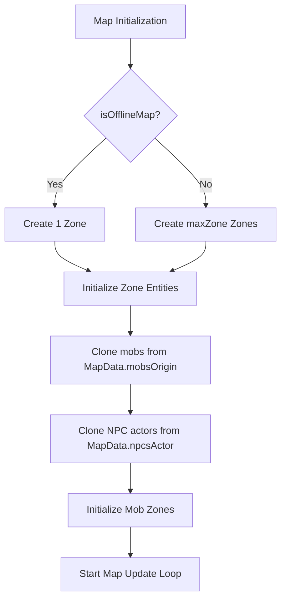
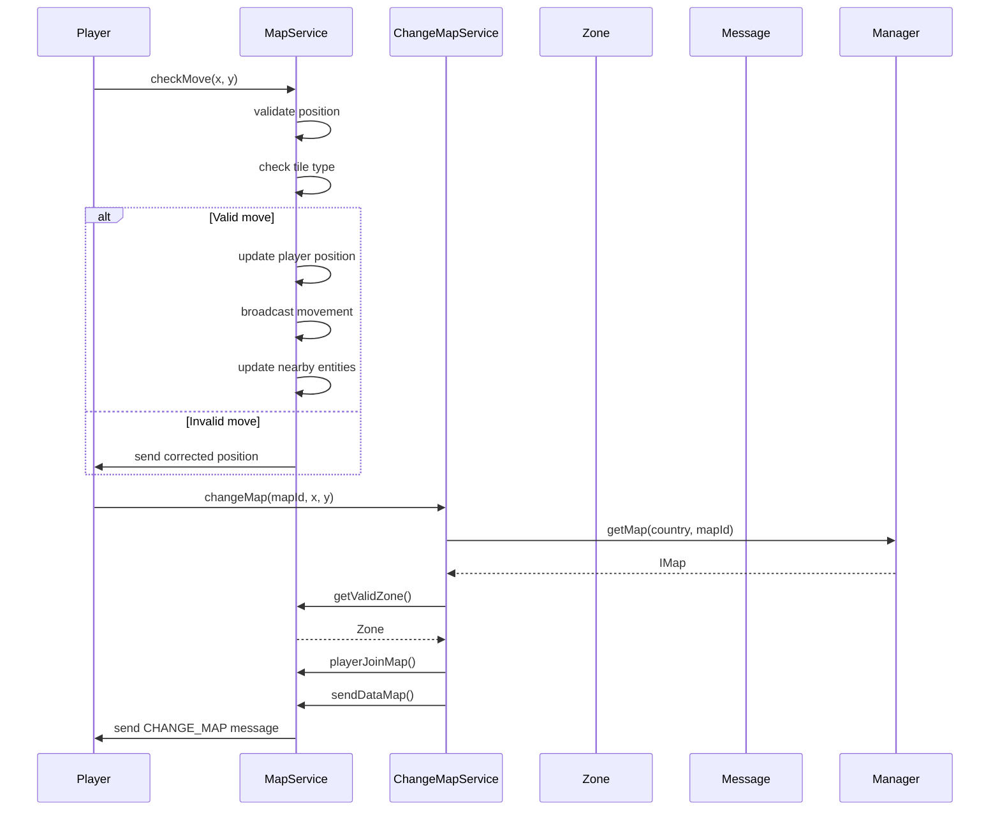
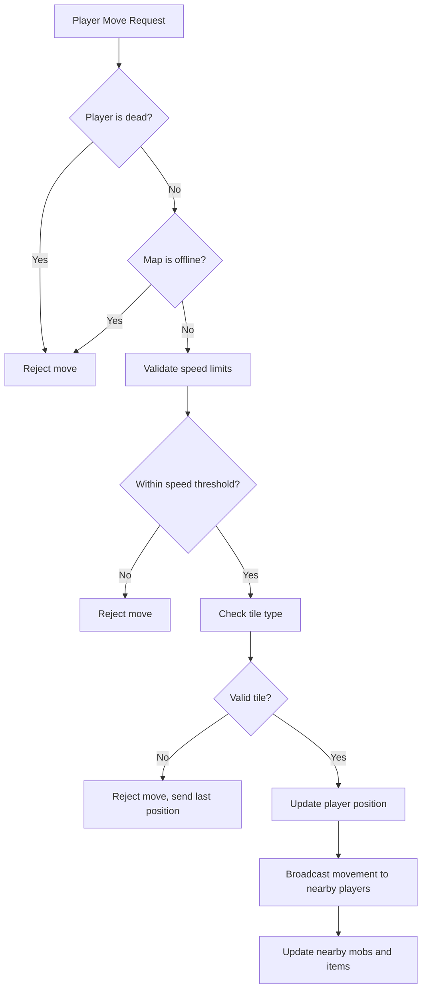
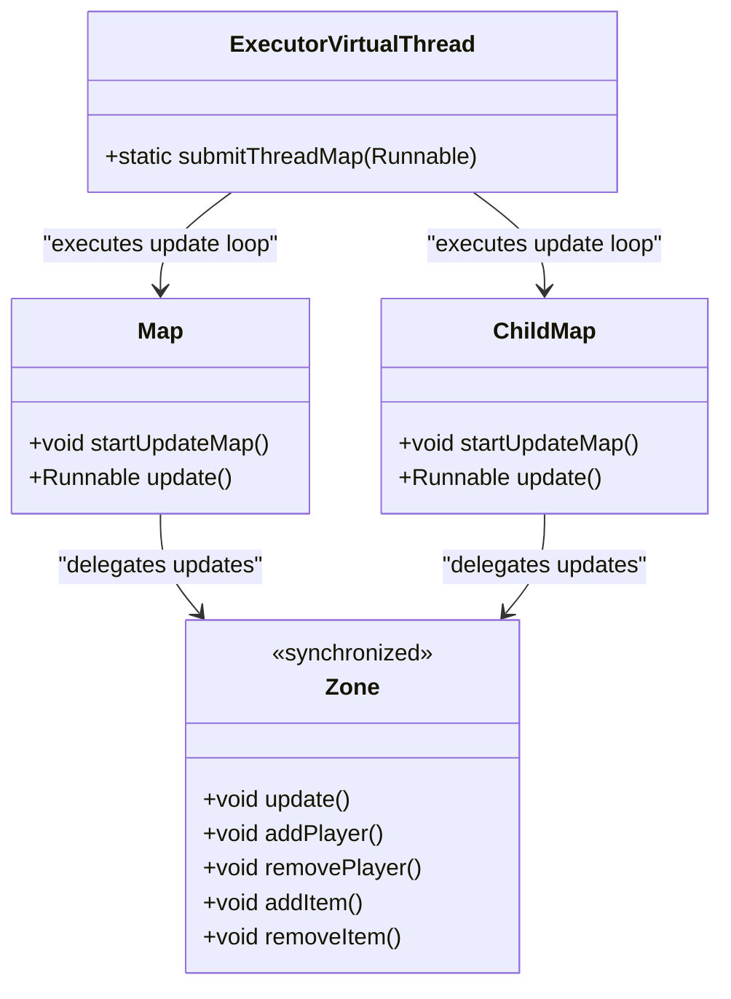

# Map Management

<cite>
**Referenced Files in This Document**   
- [Map.java](file://src/main/java/map/Map.java)
- [ChildMap.java](file://src/main/java/map/ChildMap.java)
- [MapData.java](file://src/main/java/map/MapData.java)
- [MapService.java](file://src/main/java/services/MapService.java)
- [ChangeMapService.java](file://src/main/java/services/ChangeMapService.java)
- [Zone.java](file://src/main/java/map/Zone.java)
- [IMap.java](file://src/main/java/interfaces/IMap.java)
</cite>

## Table of Contents
1. [Introduction](#introduction)
2. [Hierarchical Map Structure](#hierarchical-map-structure)
3. [Map Initialization and Data Loading](#map-initialization-and-data-loading)
4. [Zone Distribution and Management](#zone-distribution-and-management)
5. [Map Transitions and Teleportation](#map-transitions-and-teleportation)
6. [Position Validation and Movement Mechanics](#position-validation-and-movement-mechanics)
7. [Concurrency and Performance Considerations](#concurrency-and-performance-considerations)
8. [Conclusion](#conclusion)

## Introduction
The map management system in this game engine provides a hierarchical structure for organizing game worlds, enabling efficient player navigation, zone distribution, and dynamic content loading. This document details the architecture of the map system, focusing on parent-child map relationships, data initialization from templates, zone management, and runtime operations including map transitions and position validation. The system is designed to handle high player density while maintaining performance through optimized concurrency and spatial partitioning.

## Hierarchical Map Structure

The map system implements a parent-child hierarchy where each `Map` can have multiple `ChildMap` instances. The `Map` class implements the `IMap` interface and serves as the parent container, while `ChildMap` represents sub-maps that inherit properties from their parent.

**Diagram sources**
- [Map.java](file://src/main/java/map/Map.java#L1-L172)
- [ChildMap.java](file://src/main/java/map/ChildMap.java#L1-L109)
- [IMap.java](file://src/main/java/interfaces/IMap.java#L1-L41)

The `Map` class maintains a list of `ChildMap` instances through the `childMaps` field. During initialization, the `initChildMap()` method creates new zones for each child map by cloning the parent's zone configuration. Child maps inherit static data from their parent's `MapData` instance, ensuring consistency while allowing for isolated runtime states.

**Section sources**
- [Map.java](file://src/main/java/map/Map.java#L50-L88)
- [ChildMap.java](file://src/main/java/map/ChildMap.java#L1-L109)

## Map Initialization and Data Loading

Map instances are initialized using template data stored in the `MapData` class, which contains static properties and configurations for a map. The `MapData` object is injected into the `Map` constructor and serves as the source of truth for map properties.

**Diagram sources**
- [MapData.java](file://src/main/java/map/MapData.java#L1-L43)
- [Map.java](file://src/main/java/map/Map.java#L1-L172)
- [Zone.java](file://src/main/java/map/Zone.java#L1-L114)

The `initZone()` method in the `Map` class creates zones based on the `maxZone` value from `MapData`. For non-offline maps, it creates multiple zones; for offline maps, only a single zone is created. Each zone is populated with monsters and NPC actors cloned from the `MapData` templates, ensuring that each map instance has its own independent set of entities.

**Section sources**
- [Map.java](file://src/main/java/map/Map.java#L15-L49)
- [MapData.java](file://src/main/java/map/MapData.java#L1-L43)

## Zone Distribution and Management

Zones serve as spatial partitions within a map, allowing for efficient entity management and player distribution. The system uses zones to limit the scope of updates and interactions, improving performance in high-density scenarios.

Each `Zone` contains lists of `Monster`, `Player`, and `ItemMap` instances. The `Zone` class provides synchronized methods for adding and removing entities, ensuring thread safety during concurrent access. The `update()` method processes all active monsters and items in the zone every second, maintaining game state consistency.

**Section sources**
- [Map.java](file://src/main/java/map/Map.java#L15-L49)
- [Zone.java](file://src/main/java/map/Zone.java#L1-L114)

## Map Transitions and Teleportation

Map transitions are managed through the `ChangeMapService` and `MapService` classes, which handle player movement between different maps and zones. The system supports both direct teleportation and waypoint-based navigation.

**Diagram sources**
- [MapService.java](file://src/main/java/services/MapService.java#L300-L350)
- [ChangeMapService.java](file://src/main/java/services/ChangeMapService.java#L1-L82)

The `doChangeMap()` method in `MapService` handles map transitions, validating the destination and checking for waypoint triggers. When a player moves into a waypoint area, they are automatically transported to the linked map coordinates. The `changeMapByXaPhu()` method in `ChangeMapService` implements teleportation via special locations, deducting currency and validating templates before execution.

**Section sources**
- [MapService.java](file://src/main/java/services/MapService.java#L300-L350)
- [ChangeMapService.java](file://src/main/java/services/ChangeMapService.java#L1-L82)

## Position Validation and Movement Mechanics

Player movement is validated through the `checkMove()` method in `MapService`, which ensures that position updates comply with game rules and spatial constraints.

The validation process checks several conditions:
- Players cannot move while dead
- Movement speed is limited by the player's speed attribute
- Positions must not collide with blocked tiles (checked via `tileTypeAtPixel()`)
- Waypoint areas trigger map transitions rather than regular movement

The system uses a distance-based loading mechanism where players only receive updates for entities within their `distanceLoad` range, reducing network traffic and processing overhead.

**Section sources**
- [MapService.java](file://src/main/java/services/MapService.java#L200-L250)

## Concurrency and Performance Considerations

The map system employs several strategies to handle concurrency and optimize performance for large-scale maps with high player density.

**Diagram sources**
- [Map.java](file://src/main/java/map/Map.java#L100-L130)
- [ChildMap.java](file://src/main/java/map/ChildMap.java#L1-L109)
- [Zone.java](file://src/main/java/map/Zone.java#L1-L114)
- [ExecutorVirtualThread.java](file://src/main/java/manager/ExecutorVirtualThread.java)

Each map runs on its own virtual thread via `ExecutorVirtualThread.submitThreadMap()`, allowing parallel processing of map updates without blocking the main game loop. The update loop runs at 1-second intervals, processing all active zones. Zone methods are synchronized to prevent race conditions when multiple players interact with the same zone simultaneously.

For entity visibility management, the system uses spatial partitioning and distance-based filtering. The `updatePlayerInside()`, `updateMobInside()`, and `updateItemMapInside()` methods in `MapService` track which entities are within each player's view range, sending updates only for relevant objects. This reduces both network bandwidth and client-side processing requirements.

**Section sources**
- [Map.java](file://src/main/java/map/Map.java#L100-L130)
- [MapService.java](file://src/main/java/services/MapService.java#L400-L450)
- [Zone.java](file://src/main/java/map/Zone.java#L1-L114)

## Conclusion
The map management system provides a robust framework for organizing game worlds through a hierarchical parent-child structure. By separating static map data (`MapData`) from runtime instances (`Map`, `ChildMap`), the system efficiently manages memory and ensures consistency across map instances. Zone-based spatial partitioning enables scalable performance, while comprehensive movement validation and teleportation mechanics provide smooth player navigation. The use of virtual threads for map updates and synchronized zone operations ensures thread safety in high-concurrency environments, making the system capable of handling large-scale multiplayer scenarios with high player density.