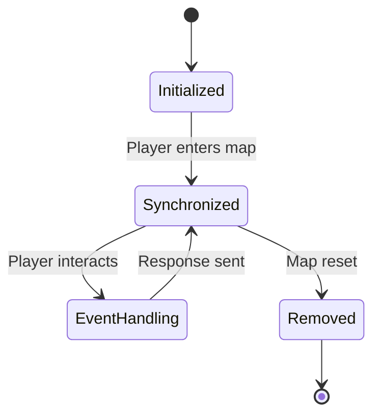
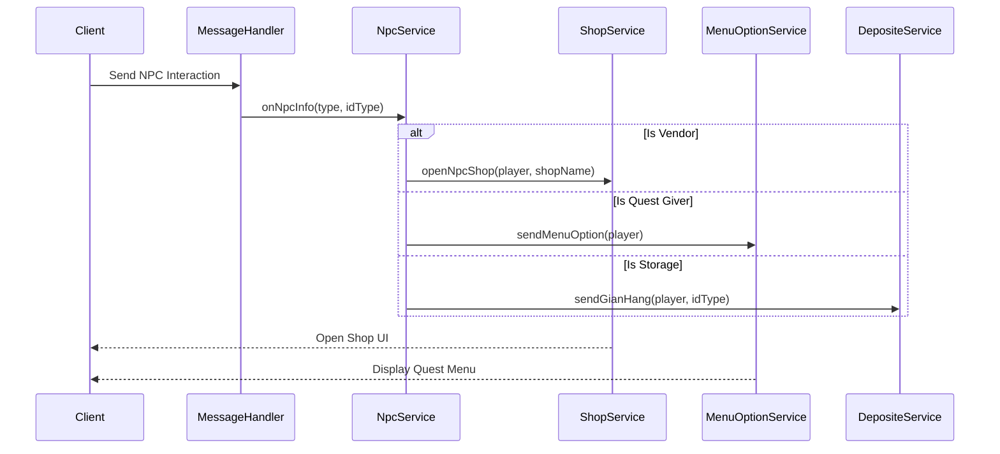

# NPC Interactions

<cite>
**Referenced Files in This Document**   
- [NpcServer.java](file://src/main/java/map/NpcServer.java)
- [NpcServerTemplate.java](file://src/main/java/template/NpcServerTemplate.java)
- [NpcTemplate.java](file://src/main/java/template/NpcTemplate.java)
- [NpcService.java](file://src/main/java/services/NpcService.java)
- [MapService.java](file://src/main/java/services/MapService.java)
- [Manager.java](file://src/main/java/manager/Manager.java)
- [NpcConst.java](file://src/main/java/consts/NpcConst.java)
</cite>

## Table of Contents
1. [Introduction](#introduction)
2. [NPC Spawning and Initialization](#npc-spawning-and-initialization)
3. [NPC Behavior and Configuration](#npc-behavior-and-configuration)
4. [NPC Lifecycle Management](#npc-lifecycle-management)
5. [Player-NPC Interaction Flow](#player-npc-interaction-flow)
6. [NPC Type Implementations](#npc-type-implementations)
7. [Common Issues and Solutions](#common-issues-and-solutions)
8. [Code Examples and State Management](#code-examples-and-state-management)

## Introduction
This document provides a comprehensive overview of NPC (Non-Player Character) interactions within the game server. It details the creation, behavior, lifecycle, and interaction mechanics of NPCs, focusing on how `NpcServer` instances are instantiated from template data, synchronized with clients, and managed during player interactions. The system leverages template-based configuration for both visual and functional aspects of NPCs, enabling flexible deployment across maps with predefined behaviors.

**Section sources**
- [NpcServer.java](file://src/main/java/map/NpcServer.java#L1-L19)
- [NpcServerTemplate.java](file://src/main/java/template/NpcServerTemplate.java#L1-L22)

## NPC Spawning and Initialization
NPCs are spawned using a two-tier template system: `NpcServerTemplate` defines core visual and positional attributes, while `NpcTemplate` contains model and equipment data. The spawning process begins with the `Manager` class loading NPC templates from the database during server initialization. Each `NpcServer` instance is constructed via the builder pattern, combining a `NpcServerTemplate` with specific coordinates (x, y) on the map.

The `MapService.sendDataMap()` method is responsible for transmitting NPC data to connected players, including position and template ID, ensuring client-side rendering consistency. NPCs are stored within `MapData.getNpcs()` and broadcast to players upon map entry or zone change.

```mermaid
flowchart TD
A[Server Start] --> B[Load Templates from DB]
B --> C[Initialize NPC Templates]
C --> D[Create NpcServer Instances]
D --> E[Assign Position (x, y)]
E --> F[Add to MapData.npcs List]
F --> G[Transmit via sendDataMap]
G --> H[Client Rendering]
```

**Diagram sources**
- [Manager.java](file://src/main/java/manager/Manager.java#L1-L1525)
- [MapService.java](file://src/main/java/services/MapService.java#L825-L852)
- [NpcServer.java](file://src/main/java/map/NpcServer.java#L1-L19)

**Section sources**
- [NpcServer.java](file://src/main/java/map/NpcServer.java#L1-L19)
- [NpcServerTemplate.java](file://src/main/java/template/NpcServerTemplate.java#L1-L22)
- [Manager.java](file://src/main/java/manager/Manager.java#L1-L1525)
- [MapService.java](file://src/main/java/services/MapService.java#L825-L852)

## NPC Behavior and Configuration
NPC behavior is determined by the `typeLimit` field in `NpcServerTemplate`, which maps to specific interaction types defined in `NpcConst`. These types dictate the functionality exposed when a player interacts with an NPC, such as opening shops, accessing storage, or initiating quests. The behavior is not hardcoded into the NPC itself but is instead resolved at runtime through the `NpcService.onNpcInfo()` method, which routes interactions based on the NPC's type.

Visual appearance is controlled by `idImage`, `w0`, `h0`, and `frame` fields, which reference sprite data loaded into `IMAGES_DEFAULT` during initialization. This allows for dynamic visual configuration without modifying logic.

**Section sources**
- [NpcServerTemplate.java](file://src/main/java/template/NpcServerTemplate.java#L1-L22)
- [NpcConst.java](file://src/main/java/consts/NpcConst.java#L1-L70)

## NPC Lifecycle Management
The NPC lifecycle consists of three main phases: initialization, client synchronization, and event handling.

1. **Initialization**: Occurs during server startup via `Manager.init()`, where NPC templates are loaded from the `npc_actor` database table into `NPC_TEMPLATES`.
2. **Client Synchronization**: Handled by `MapService.sendDataMap()`, which sends NPC metadata (position, name, image ID) to players entering a map.
3. **Event Handling**: Triggered by player interaction, routed through `NpcService.onNpcInfo()`, which dispatches appropriate responses based on NPC type.

NPCs remain persistent on the map unless explicitly removed by administrative actions or map resets.



**Diagram sources**
- [Manager.java](file://src/main/java/manager/Manager.java#L1-L1525)
- [MapService.java](file://src/main/java/services/MapService.java#L825-L852)
- [NpcService.java](file://src/main/java/services/NpcService.java#L1-L74)

**Section sources**
- [NpcService.java](file://src/main/java/services/NpcService.java#L1-L74)
- [MapService.java](file://src/main/java/services/MapService.java#L825-L852)
- [Manager.java](file://src/main/java/manager/Manager.java#L1-L1525)

## Player-NPC Interaction Flow
The interaction flow between players and NPCs is mediated by `NpcService`, which receives interaction events and delegates to appropriate service handlers. When a player clicks an NPC, the client sends a message that is processed by `MessageHandler`, eventually invoking `NpcService.onNpcInfo()` with the NPC type and subtype.

The service uses a switch statement on the `type` parameter to determine the correct action:
- Quest givers trigger menu options via `MenuOptionService`
- Vendors open shops via `ShopService.openNpcShop()`
- Storage NPCs open inventory interfaces via `DepositeService.sendGianHang()`

Each interaction updates the player's `Sundry` state to track the currently open NPC context.



**Diagram sources**
- [NpcService.java](file://src/main/java/services/NpcService.java#L1-L74)
- [ShopService.java](file://src/main/java/services/ShopService.java#L1-L100)
- [MenuOptionService.java](file://src/main/java/services/MenuOptionService.java#L1-L100)

**Section sources**
- [NpcService.java](file://src/main/java/services/NpcService.java#L1-L74)

## NPC Type Implementations
Different NPC types exhibit distinct behaviors based on their `type` value from `NpcConst`:

| NPC Type | Constant | Service Handler | Functionality |
|---------|--------|----------------|-------------|
| Vendor | KIEM_SU, BAO_NGOC | ShopService.openNpcShop() | Opens item shop |
| Quest Giver | HOA_TIEU_NEW | MenuOptionService.sendMenuHoaTieu() | Presents quest options |
| Trainer | GIAP_SU | MenuOptionService.sendOptionBuyItem() | Offers skill training |
| Storage | NHAT_GIAP | DepositeService.sendGianHang() | Opens storage interface |
| Teleporter | CONG_DICH_CHUYEN | MenuOptionService.sendMenuCongDichChuyen() | Provides teleport options |

These types are not represented as separate classes but are instead differentiated through their type constants and the corresponding service methods they invoke.

**Section sources**
- [NpcConst.java](file://src/main/java/consts/NpcConst.java#L1-L70)
- [NpcService.java](file://src/main/java/services/NpcService.java#L1-L74)

## Common Issues and Solutions
### NPC Desynchronization
Occurs when client and server state diverge, typically after map transitions. Mitigated by ensuring `sendDataMap()` is called after all map changes and validating NPC positions during zone entry.

### Pathfinding Limitations
NPCs in this system are static and do not perform pathfinding. They are assigned fixed positions and do not move autonomously. This eliminates pathfinding issues but limits dynamic behavior.

### Thread Safety
All NPC interactions are handled within the player's session thread via `ExecutorVirtualThread`. The `NpcService` is a singleton with no mutable state, making it thread-safe. Player-specific state (e.g., `Sundry.idNpcOpen`) is stored in the `Player` object, which is accessed within the player's dedicated thread context.

**Section sources**
- [NpcService.java](file://src/main/java/services/NpcService.java#L1-L74)
- [Manager.java](file://src/main/java/manager/Manager.java#L1-L1525)
- [ExecutorVirtualThread.java](file://src/main/java/manager/ExecutorVirtualThread.java#L1-L50)

## Code Examples and State Management
The `NpcService.onNpcInfo()` method demonstrates state management by setting `player.getSundry().setIdNpcOpen(type)` before delegating to the appropriate service. This preserves context for subsequent interactions.

For example, when interacting with a vendor:
```java
case NpcConst.KIEM_SU -> 
    ShopService.instance.openNpcShop(player, "KIEM_SU", ItemEquipConst.DAMAGE_NONE);
```

This pattern ensures that interaction logic remains decoupled from state management, with `NpcService` acting as a router and `Sundry` maintaining interaction context.

**Section sources**
- [NpcService.java](file://src/main/java/services/NpcService.java#L1-L74)
- [Player.java](file://src/main/java/player/Player.java#L1-L200)
- [Sundry.java](file://src/main/java/player/Sundry.java#L1-L50)