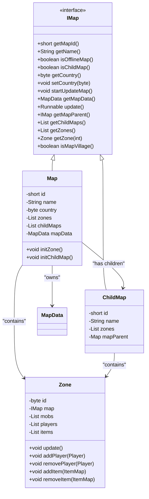
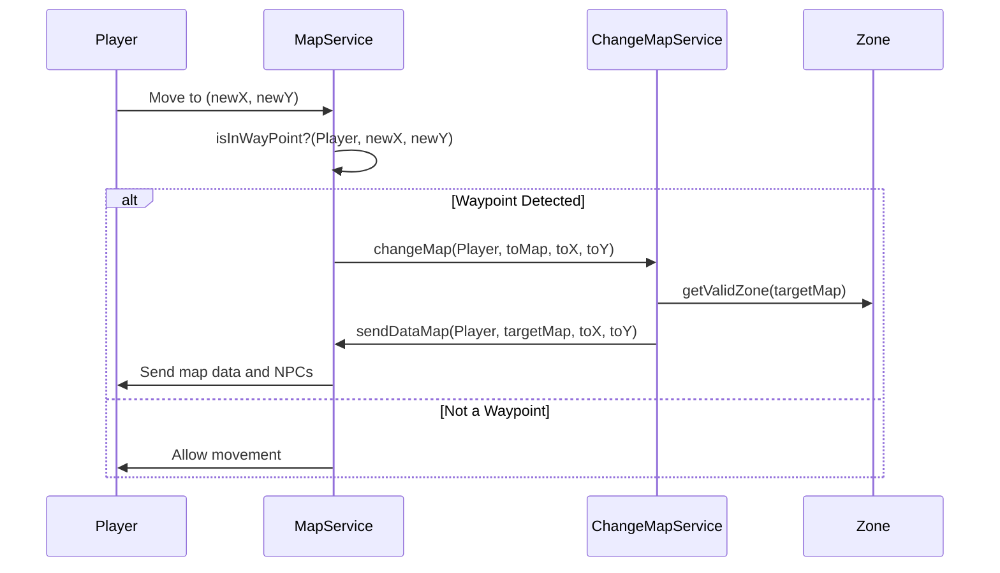
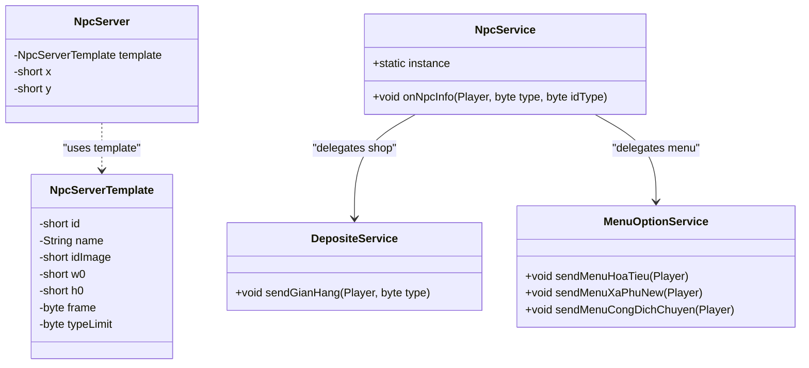
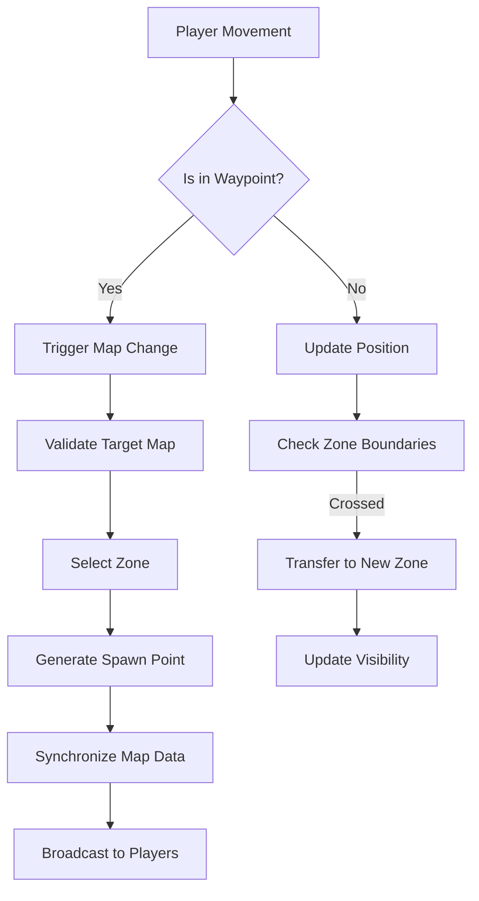

# World System

<cite>
**Referenced Files in This Document**   
- [Map.java](file://src/main/java/map/Map.java)
- [ChildMap.java](file://src/main/java/map/ChildMap.java)
- [MapData.java](file://src/main/java/map/MapData.java)
- [WayPoint.java](file://src/main/java/map/WayPoint.java)
- [LoctionWayPoint.java](file://src/main/java/map/LoctionWayPoint.java)
- [Zone.java](file://src/main/java/map/Zone.java)
- [NpcServer.java](file://src/main/java/map/NpcServer.java)
- [NpcServerTemplate.java](file://src/main/java/template/NpcServerTemplate.java)
- [Location.java](file://src/main/java/player/Location.java)
- [MapService.java](file://src/main/java/services/MapService.java)
- [ChangeMapService.java](file://src/main/java/services/ChangeMapService.java)
- [ExecutorVirtualThread.java](file://src/main/java/manager/ExecutorVirtualThread.java)
- [NpcService.java](file://src/main/java/services/NpcService.java)
</cite>

## Table of Contents
1. [Introduction](#introduction)
2. [Map Architecture and Zone Management](#map-architecture-and-zone-management)
3. [Waypoint Navigation and Player Movement Validation](#waypoint-navigation-and-player-movement-validation)
4. [NPC Spawning, Behavior, and Interaction Mechanics](#npc-spawning-behavior-and-interaction-mechanics)
5. [Map Loading, Zone Transitions, and Position Synchronization](#map-loading-zone-transitions-and-position-synchronization)
6. [Common World Interactions](#common-world-interactions)
7. [Performance Optimization and Concurrency Handling](#performance-optimization-and-concurrency-handling)

## Introduction
The World System forms the backbone of the game environment, managing spatial organization, player navigation, NPC behavior, and dynamic interactions across maps and zones. This document details the infrastructure responsible for world simulation, including hierarchical map structures, waypoint-based navigation, NPC mechanics, and performance considerations for concurrent player activity.

## Map Architecture and Zone Management

The game world is structured using a hierarchical map system where each `Map` can have multiple `ChildMap` instances, enabling scalable and modular world design. The `Map` class implements the `IMap` interface, defining core behaviors such as zone initialization, update cycles, and child map management.

Each map is divided into zones to distribute player load and manage entity interactions efficiently. Zones are dynamically initialized based on map configuration, with each zone containing players, monsters, and items. The number of zones per map is determined by `maxZone` in `MapData`, except for offline maps which use a single zone.

**Diagram sources**
- [Map.java](file://src/main/java/map/Map.java#L0-L172)
- [ChildMap.java](file://src/main/java/map/ChildMap.java#L0-L108)
- [Zone.java](file://src/main/java/map/Zone.java#L0-L114)
- [IMap.java](file://src/main/java/interfaces/IMap.java#L0-L40)

**Section sources**
- [Map.java](file://src/main/java/map/Map.java#L0-L172)
- [ChildMap.java](file://src/main/java/map/ChildMap.java#L0-L108)
- [Zone.java](file://src/main/java/map/Zone.java#L0-L114)

## Waypoint Navigation and Player Movement Validation

Waypoints serve as navigation anchors that allow players to transition between maps or specific locations. The `WayPoint` class defines destination coordinates (`toX`, `toY`) and target map ID (`toMap`). These are stored in a 3D array within `MapData` to support layered navigation grids.

`LoctionWayPoint` extends this system by mapping pixel coordinates to specific waypoints, enabling collision-based activation. The `MapService.isInWayPoint()` method validates player position against waypoint regions using bitmasked tile types, where values ≥ 2000000000 indicate a waypoint tile.

Player movement is validated using pixel-to-tile conversion (via `Const.SIP` bit shifting) and checked against the `type` array in `MapData`. This ensures only valid terrain types are traversable.

**Diagram sources**
- [WayPoint.java](file://src/main/java/map/WayPoint.java#L0-L28)
- [LoctionWayPoint.java](file://src/main/java/map/LoctionWayPoint.java#L0-L18)
- [MapService.java](file://src/main/java/services/MapService.java#L635-L773)
- [ChangeMapService.java](file://src/main/java/services/ChangeMapService.java#L0-L82)

**Section sources**
- [WayPoint.java](file://src/main/java/map/WayPoint.java#L0-L28)
- [LoctionWayPoint.java](file://src/main/java/map/LoctionWayPoint.java#L0-L18)
- [MapService.java](file://src/main/java/services/MapService.java#L635-L773)

## NPC Spawning, Behavior, and Interaction Mechanics

NPCs are defined through templates (`NpcServerTemplate`) and instantiated as `NpcServer` objects with position and visual properties. They are loaded from `MapData` during map initialization and broadcast to players upon map entry.

NPC interaction is handled by `NpcService`, which routes player requests based on NPC type (`idType`). Different NPC types trigger specific UI menus (e.g., deposit shops, teleportation menus) via `MenuOptionService`. The `DepositeService.sendGianHang()` method is used to display shop interfaces for armor NPCs.

NPCs are static entities that do not move but serve as interaction points for services like trading, teleportation, and quests. Their behavior is event-driven, responding to player-initiated actions rather than autonomous logic.

**Diagram sources**
- [NpcServerTemplate.java](file://src/main/java/template/NpcServerTemplate.java#L0-L20)
- [NpcServer.java](file://src/main/java/map/NpcServer.java#L0-L17)
- [NpcService.java](file://src/main/java/services/NpcService.java#L0-L37)
- [DepositeService.java](file://src/main/java/services/DepositeService.java#L268-L277)

**Section sources**
- [NpcServer.java](file://src/main/java/map/NpcServer.java#L0-L17)
- [NpcService.java](file://src/main/java/services/NpcService.java#L0-L37)

## Map Loading, Zone Transitions, and Position Synchronization

Map transitions are managed by `ChangeMapService`, which handles both direct teleportation and waypoint-triggered movement. When a player changes maps, the system:

1. Validates the target map via `Manager.getMap()`
2. Preserves last location for potential return
3. Selects a valid zone using `MapService.getValidZone()`
4. Assigns random spawn coordinates within safe margins (30% from edges)
5. Synchronizes map data, NPCs, and current position to the client

Position synchronization occurs through `MapService.sendDataMap()`, which transmits the current map state, including waypoints and NPCs. Player coordinates are updated in `Location`, and movement is broadcast via `MapService.sendMove()`.

Offline maps (e.g., personal villages) have special handling: players return to their last zone upon exit, and spawn positions are fixed.

**Section sources**
- [ChangeMapService.java](file://src/main/java/services/ChangeMapService.java#L0-L82)
- [MapService.java](file://src/main/java/services/MapService.java#L662-L797)
- [Location.java](file://src/main/java/player/Location.java#L0-L46)

## Common World Interactions

### Teleportation
Players teleport via NPCs like "Xa Phu" using `ChangeMapService.changeMapByXaPhu()`. This deducts a configured cost in xu and moves the player to predefined coordinates.

### NPC Dialogue
Interacting with NPCs triggers `NpcService.onNpcInfo()`, which dispatches UI menus based on NPC type. No text dialogue system is implemented; instead, menu options are presented directly.

### Area Transitions
Waypoint-based transitions are seamless: when a player steps on a waypoint tile, the system detects it and initiates a map change with destination coordinates derived from the waypoint data.

## Performance Optimization and Concurrency Handling

The system uses virtual threads via `ExecutorVirtualThread` to handle concurrent map updates. Each map runs on a dedicated virtual thread, executing zone updates every second. This ensures scalability without blocking the main server loop.

Zone-based player distribution limits entity interaction scope. Only players within the same zone can see and interact with each other, reducing network load. The `sendAllPlayerInMap()` method filters recipients by distance and session load radius.

Map data is shared between parent and child maps via `MapData`, minimizing memory duplication. Child maps inherit mob and NPC configurations but maintain independent player and item lists.

**Diagram sources**
- [ExecutorVirtualThread.java](file://src/main/java/manager/ExecutorVirtualThread.java#L0-L36)
- [MapService.java](file://src/main/java/services/MapService.java#L772-L797)
- [Zone.java](file://src/main/java/map/Zone.java#L0-L114)

**Section sources**
- [ExecutorVirtualThread.java](file://src/main/java/manager/ExecutorVirtualThread.java#L0-L36)
- [MapService.java](file://src/main/java/services/MapService.java#L772-L797)