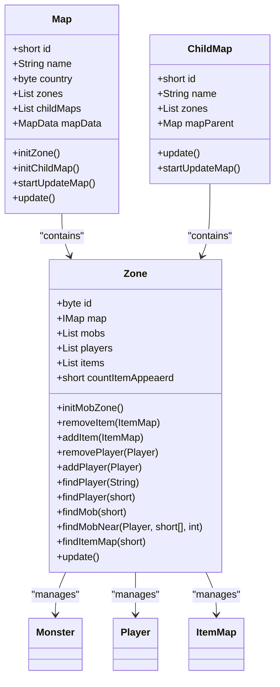
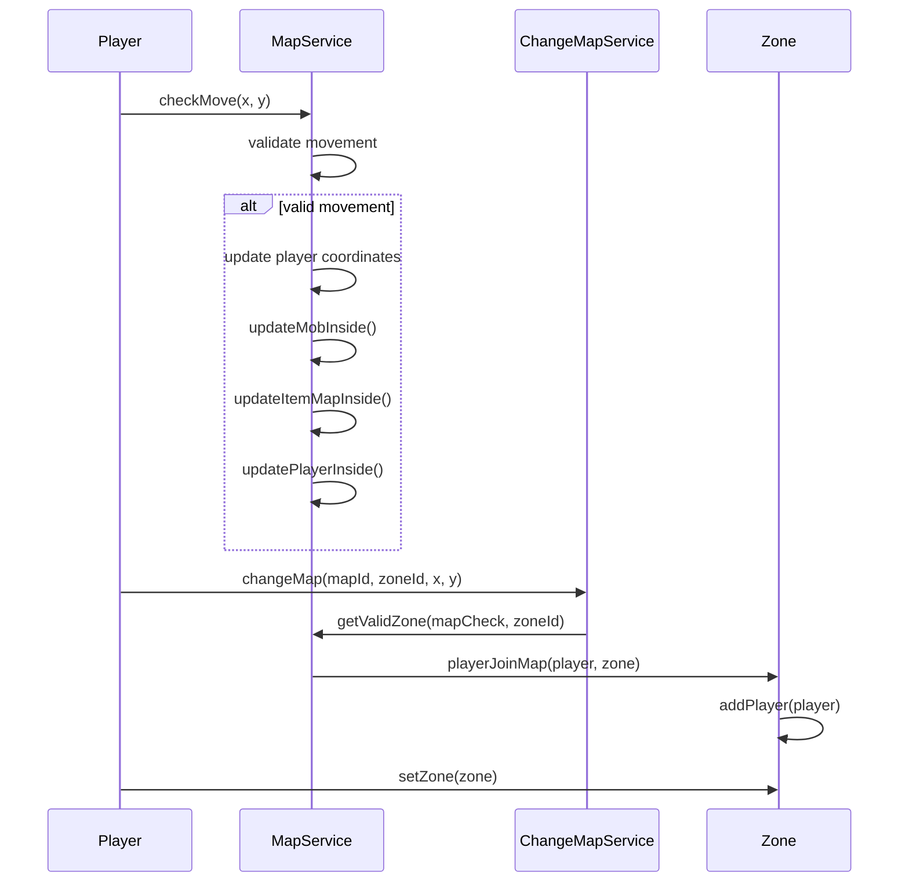
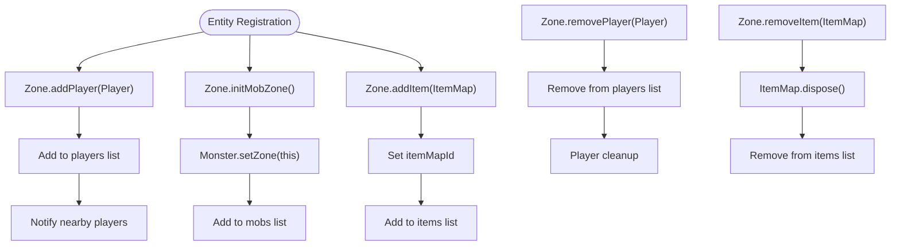
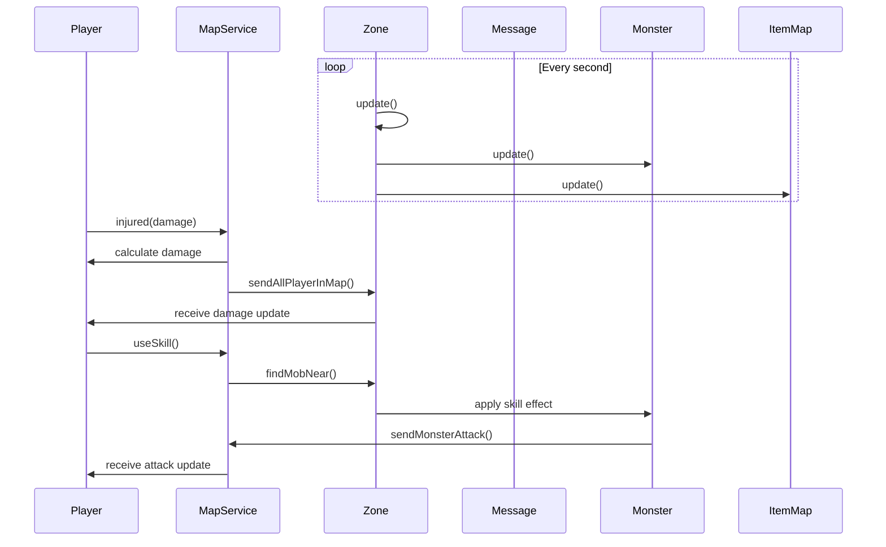
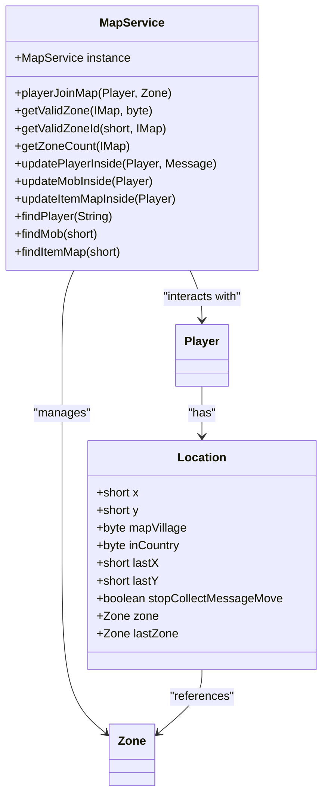
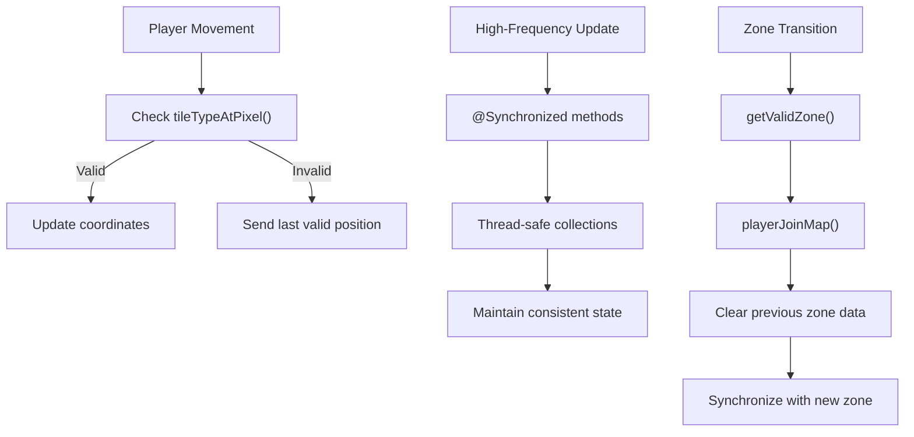

# Zone System

<cite>
**Referenced Files in This Document**   
- [Zone.java](file://src/main/java/map/Zone.java)
- [MapService.java](file://src/main/java/services/MapService.java)
- [Map.java](file://src/main/java/map/Map.java)
- [Player.java](file://src/main/java/player/Player.java)
- [Location.java](file://src/main/java/player/Location.java)
- [ChangeMapService.java](file://src/main/java/services/ChangeMapService.java)
</cite>

## Table of Contents
1. [Introduction](#introduction)
2. [Zone-Based World Partitioning](#zone-based-world-partitioning)
3. [Player Assignment and Zone Transitions](#player-assignment-and-zone-transitions)
4. [Actor Registration and Entity Tracking](#actor-registration-and-entity-tracking)
5. [Synchronization and Event Processing](#synchronization-and-event-processing)
6. [Zone Lookup and Entity Management](#zone-lookup-and-entity-management)
7. [Common Issues and Concurrency Handling](#common-issues-and-concurrency-handling)

## Introduction
The zone-based world partitioning system is a critical architectural component designed to manage large-scale multiplayer environments efficiently. This system divides game maps into discrete zones to optimize player distribution, reduce network load, and enhance performance. Each zone acts as an independent container for game entities such as players, monsters, and items, enabling localized updates and interactions. This document provides a comprehensive analysis of the zone system, detailing its implementation, functionality, and integration within the game architecture.

## Zone-Based World Partitioning

The zone system partitions game maps into manageable segments to distribute players and entities effectively. Each map contains multiple zones, with the number determined by the map's configuration. Zones are initialized during map setup and serve as containers for all active entities within their boundaries.

**Diagram sources**
- [Zone.java](file://src/main/java/map/Zone.java#L1-L114)
- [Map.java](file://src/main/java/map/Map.java#L1-L172)
- [ChildMap.java](file://src/main/java/map/ChildMap.java#L1-L108)

**Section sources**
- [Zone.java](file://src/main/java/map/Zone.java#L1-L114)
- [Map.java](file://src/main/java/map/Map.java#L1-L172)

## Player Assignment and Zone Transitions

Players are assigned to zones based on their current map coordinates and movement patterns. The system handles zone transitions seamlessly during player movement, ensuring continuous gameplay experience. When a player moves between zones, the system updates their location and synchronizes their state across the new zone.

**Diagram sources**
- [MapService.java](file://src/main/java/services/MapService.java#L197-L226)
- [ChangeMapService.java](file://src/main/java/services/ChangeMapService.java#L37-L62)
- [MapService.java](file://src/main/java/services/MapService.java#L851-L879)

**Section sources**
- [MapService.java](file://src/main/java/services/MapService.java#L197-L226)
- [ChangeMapService.java](file://src/main/java/services/ChangeMapService.java#L37-L62)

## Actor Registration and Entity Tracking

The zone system manages actor registration and entity tracking through synchronized methods that ensure thread-safe operations. Players, monsters, and items are registered within zones and tracked using dedicated collections. The system maintains references to all active entities within each zone, enabling efficient lookups and updates.

**Diagram sources**
- [Zone.java](file://src/main/java/map/Zone.java#L58-L114)
- [Player.java](file://src/main/java/player/Player.java#L1-L309)

**Section sources**
- [Zone.java](file://src/main/java/map/Zone.java#L58-L114)
- [Player.java](file://src/main/java/player/Player.java#L1-L309)

## Synchronization and Event Processing

The zone system maintains synchronization between zones and the parent map through periodic updates and event propagation. Zone-specific events such as combat, skill usage, and item interactions are processed within the context of the current zone. The system ensures that all relevant players receive updates about entities within their proximity.

**Diagram sources**
- [Zone.java](file://src/main/java/map/Zone.java#L109-L114)
- [Map.java](file://src/main/java/map/Map.java#L109-L138)
- [MapService.java](file://src/main/java/services/MapService.java#L547-L638)

**Section sources**
- [Zone.java](file://src/main/java/map/Zone.java#L109-L114)
- [Map.java](file://src/main/java/map/Map.java#L109-L138)

## Zone Lookup and Entity Management

The system provides efficient zone lookup and entity management through dedicated service methods. The MapService class offers utility functions for finding valid zones and retrieving entities based on various criteria. These methods are used extensively throughout the game logic to locate players, monsters, and items within specific zones.

**Diagram sources**
- [MapService.java](file://src/main/java/services/MapService.java#L851-L879)
- [Location.java](file://src/main/java/player/Location.java#L1-L47)

**Section sources**
- [MapService.java](file://src/main/java/services/MapService.java#L851-L879)
- [Location.java](file://src/main/java/player/Location.java#L1-L47)

## Common Issues and Concurrency Handling

The zone system addresses common issues such as zone boundary glitches and concurrency during high-frequency updates through synchronized methods and careful state management. The system uses @Synchronized annotations to ensure thread safety when modifying shared collections. Boundary checks prevent invalid movements, and distance-based filtering optimizes network traffic by only sending updates to relevant players.

**Diagram sources**
- [MapService.java](file://src/main/java/services/MapService.java#L197-L226)
- [Zone.java](file://src/main/java/map/Zone.java#L58-L114)

**Section sources**
- [MapService.java](file://src/main/java/services/MapService.java#L197-L226)
- [Zone.java](file://src/main/java/map/Zone.java#L58-L114)